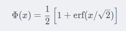

# Sniper

这个文件主要是小工具（我也不知道为啥在这里不在snippets里）和适配tf的各个版本。

### def gelu_erf()

[&SOURCE](https://github.com/bojone/bert4keras/blob/master/bert4keras/backend.py#L28 )

    def gelu_erf(x)

基于Erf直接计算的gelu函数

根据公式

计算gelu。

### def gelu_tanh()

[&SOURCE](https://github.com/bojone/bert4keras/blob/master/bert4keras/backend.py#L34 )

    def gelu_tanh(x)

基于Tanh近似计算的gelu函数

### def set_gelu()

[&SOURCE](https://github.com/bojone/bert4keras/blob/master/bert4keras/backend.py#L43 )

    def set_gelu(version)

设置gelu版本（由于gelu没有精确数学表达，只能近似拟合，gelu有两个拟合版本），根据传入的version，动态的选择`gelu_tanh()`和`gelu_erf()`

其中：

|参数| 说明|
|:-----  |-----|
|version|版本:str|

其中 `assert version in ['erf', 'tanh']`

### def piecewise_linear()

[&SOURCE](https://github.com/bojone/bert4keras/blob/master/bert4keras/backend.py#L54 )

    def piecewise_linear(t, schedule)

分段线性函数。

用来给optimizers中的分断线性学习率优化器[def extend_with_piecewise_linear_lr_v2()](https://github.com/Sniper970119/bert4keras_document/tree/master/optimizers#def-extend_with_piecewise_linear_lr_v2() )提供基础方法。

### def search_layer()

[&SOURCE](https://github.com/bojone/bert4keras/blob/master/bert4keras/backend.py#L82 )

    def search_layer(inputs, name, exclude_from=None)

根据inputs和name来搜索层

根据inputs一直往上递归搜索，直到发现名字为name的层为止（所以输入应该是output）；如果找不到，那就返回None。

其中：

|参数| 说明|
|:-----  |-----|
|inputs|某个层或某个层的输出:Tensor or EagerTensor|
|name|目标层的名字:str|
|exclude_from|排除的名单:list|

### def sequence_masking()

[&SOURCE](https://github.com/bojone/bert4keras/blob/master/bert4keras/backend.py#L117 )

    def sequence_masking(x, mask, value=0.0, axis=None)

序列条件mask的函数

其中：

|参数| 说明|
|:-----  |-----|
|x|输入数据 |
|mask|形如(batch_size, seq_len)的0-1矩阵|
|value| mask部分要被替换成的值，可以是'-inf'或'inf'；:str or float|
|axis|序列所在轴,默认为1:int|

